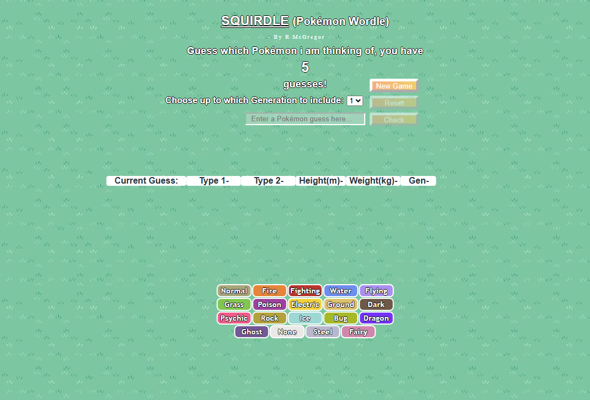

# Wordle-Pokemon-edition

Pokemon version of Wordle, inspired by Squirdle.com

This is an updated Typescript version of my original code. I have updated the game to include the first 3 generations of pokemon. All credit for the pokemon sprites goes to -- https://github.com/PokeAPI/sprites/tree/master

For a working example of the code, please use my Code Sandbox link below:

https://5gmt4g-1234.csb.app/

Alternatively, you can use this CodePen link below for an older, JS version of the same game:

https://codepen.io/BobbyArmac/full/VYvLwab 
